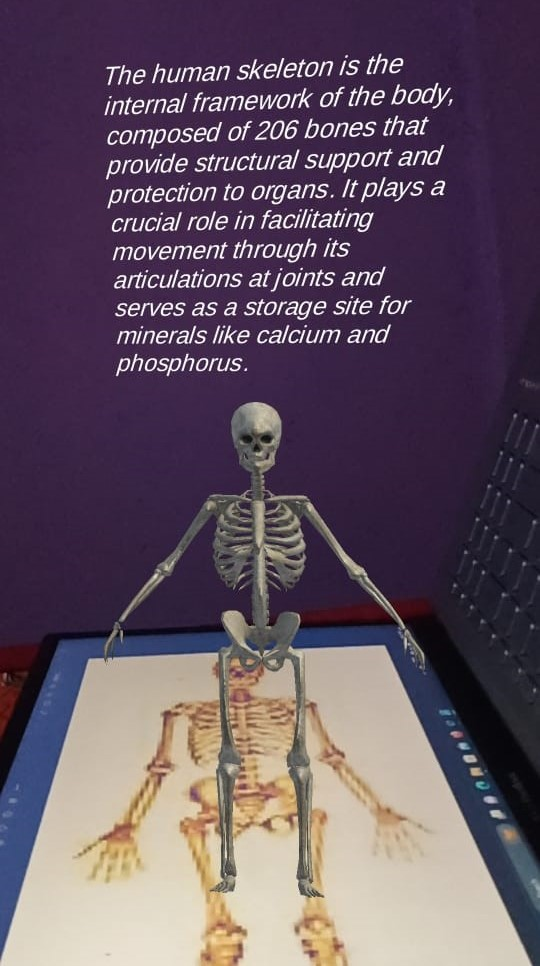

# 📱 AR in Education


## 🎯 Overview

**AR in Education** is an interactive mobile application developed using Unity 3D and Vuforia Engine, aimed at revolutionizing primary education in rural areas. The app uses image recognition to project a rotating 3D model when a target image is scanned, accompanied by a brief descriptive narration. This immersive learning experience is designed to enhance student engagement, promote curiosity, and make learning both educational and enjoyable.

## 🌟 Features

- 📸 Camera-enabled image recognition
- 🌀 Real-time 360° 3D model animation
- 📝 Educational content alongside models
- 👦 Designed for rural primary school students
- 💰 Cost-efficient solution for scalable deployment

## 🔧 Technologies Used

- **Unity 3D**
- **Vuforia Engine**
- **Android SDK**
- **C# for scripting**

## 📄 Related Research

This project is backed by our peer-reviewed research paper:

> **The Impact of Augmented Reality: Applications in Education**  
> *Khushi Rao, Daniel Kr Brahma, Jagriti Das, Alongbar Wary, Gaurav Indra*  
> Published in **Computational Intelligence and Mathematical Applications**, CRC Press, 2024  
> Pages: 300–304  
> 📅 Publication Date: *August 29, 2024*

> This paper explores a low-cost, infrastructure-friendly approach to AR-based learning tools aimed at rural primary schools. It validates the system's effectiveness through statistical analysis and shows a measurable improvement in children's engagement and concentration.

## 📚 How to Cite

If you find this project or research helpful in your academic work, please cite our paper as follows:

### ➤ BibTeX

```
@inproceedings{rao2024impact,
  title     = {The Impact of Augmented Reality: Applications in Education},
  author    = {Khushi Rao and Daniel Kr Brahma and Jagriti Das and Alongbar Wary and Gaurav Indra},
  booktitle = {Computational Intelligence and Mathematical Applications},
  pages     = {300--304},
  year      = {2024},
  publisher = {CRC Press}
}
```

### ➤ APA Style

Rao, K., Brahma, D. K., Das, J., Wary, A., & Indra, G. (2024). *The Impact of Augmented Reality: Applications in Education*. In *Computational Intelligence and Mathematical Applications* (pp. 300–304). CRC Press.

## 📸 Screenshots

<p align="center">
  
  
</p>

## 💡 Future Improvements

- Add voice narration
- Introduce interactive quiz modules
- Expand target database for more topics

## 🤝 Acknowledgements

Thanks to Unity, Vuforia, and the educational institutions that supported this initiative.

---

